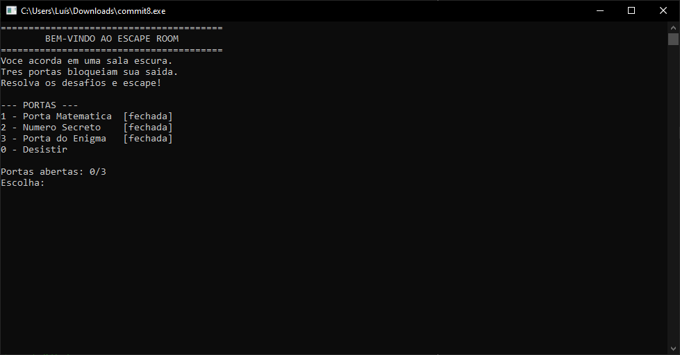
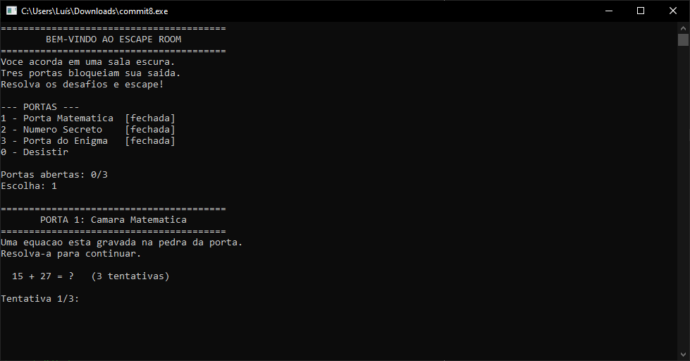
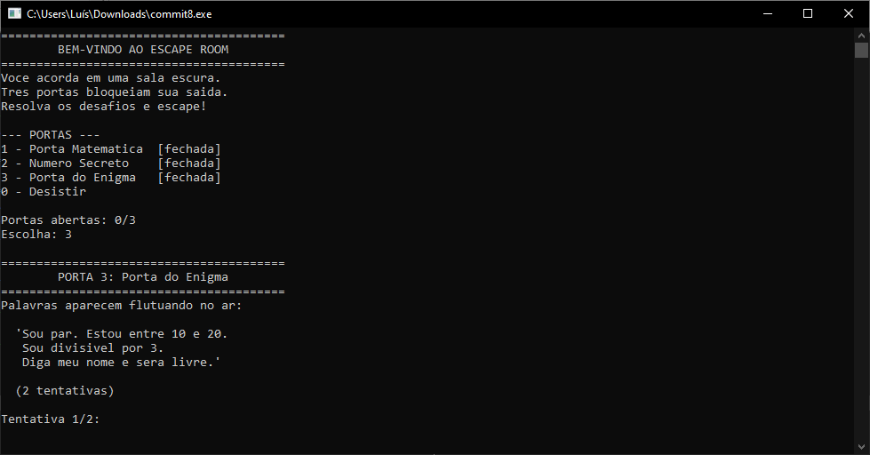

# 🔐 Escape Room — Programação

<div align="center">





</div>

---

## 📖 História

> Você acorda em uma sala escura. A única luz vem de um terminal piscando na sua frente.
>
> Uma mensagem aparece na tela:
>
> **"Você tem chances limitadas por desafio. Falhe demais... e a porta nunca abrirá."**
>
> Para escapar, você precisará resolver desafios matemáticos, adivinhar números secretos e decifrar enigmas lógicos.
> Cada porta que você abrir revela outra. Cada acerto te aproxima da liberdade.
>
> **Boa sorte. Você vai precisar.**

---

## 🎮 Como Funciona

O jogo é dividido em **3 portas** — cada uma com um desafio diferente:

| Porta | Nome | Desafio |
|-------|------|---------|
| 🔢 Porta 1 | Câmara Matemática | Resolva uma conta para avançar |
| 🎯 Porta 2 | Número Secreto | Adivinhe o número com dicas de alto/baixo |
| 🧠 Porta 3 | Enigma Final | Descubra o número a partir de pistas lógicas |

Cada porta tem um número limitado de tentativas. Abra as 3 e escape!

---

## ▶️ Como Executar

### Dev-C++ (Windows)
1. Abra o **Dev-C++**
2. **Arquivo → Abrir** → selecione `escape_room.c`
3. Pressione **F11** para compilar e executar

### Terminal (Linux/Mac)
```bash
gcc escape_room.c -o escape_room
./escape_room
```

### Terminal (Windows)
```bash
gcc escape_room.c -o escape_room.exe
escape_room.exe
```

---

## 🖥️ Exemplo de Execução

```
========================================
        BEM-VINDO AO ESCAPE ROOM
========================================
Voce acorda em uma sala escura.
Tres portas bloqueiam sua saida.

--- PORTAS ---
1 - Porta Matematica  [fechada]
2 - Numero Secreto    [fechada]
3 - Porta do Enigma   [fechada]
0 - Desistir

Portas abertas: 0/3
Escolha: 1

--- PORTA 1: Camara Matematica ---
  15 + 27 = ?   (3 tentativas)

Tentativa 1/3: 42
>>> A porta range e se abre! Voce avanca. <<<
```

---

## 🛠️ Conceitos Utilizados

- Entrada e saída com `scanf` / `printf`
- Estruturas condicionais `if/else`
- Laços de repetição `while`
- Funções
- Números aleatórios com `rand()` e `srand()`
- Variáveis e contadores

---

## 👥 Equipe

| Nome |
|------|
| Luís Felipe de Melo Loiola |
---

<div align="center">

*Feito com ☕ e muita lógica.*

</div>
